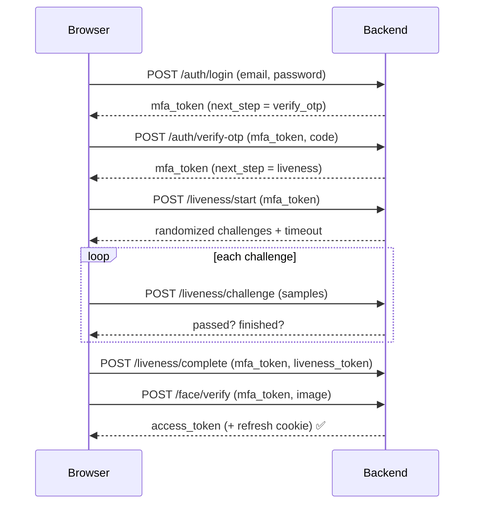

# AI Secure MFA

An AI-powered, multi-factor authentication system built as a full-stack web app. It layers **five independent factors** on top of a normal account — something you know (password), something you receive (email OTP), and something you *are* (face recognition + AI liveness + active challenge–response) — and makes **every** authentication decision on the server.

> **Security-first by design.** The frontend is never trusted to decide whether a user passed a check. The browser only captures images and reports raw numeric signals; the backend runs the face-recognition model, scores liveness, validates OTPs, and issues tokens. See [Security model](#security-model).

---

## Table of contents

- [Features](#features)
- [Architecture](#architecture)
- [Repository layout](#repository-layout)
- [Quick start (Docker)](#quick-start-docker)
- [Local development](#local-development)
- [Configuration reference](#configuration-reference)
- [The authentication flow](#the-authentication-flow)
- [Security model](#security-model)
- [API overview](#api-overview)
- [Database & migrations](#database--migrations)
- [Testing](#testing)
- [Troubleshooting](#troubleshooting)
- [Production hardening checklist](#production-hardening-checklist)

---

## Features

1. **Email + password auth** — Argon2id password hashing, never plaintext.
2. **Email OTP verification** — time-limited one-time codes, stored only as salted HMAC hashes.
3. **Face enrollment** — multiple samples captured in-browser, embedded server-side with ArcFace, encrypted at rest.
4. **Face recognition** — cosine similarity against the enrolled embedding, threshold owned by the backend.
5. **AI face liveness detection** — server scores real webcam signal quality (single face, detection confidence, framing).
6. **Challenge–response liveness** — randomized prompts (blink, turn left/right, tilt, look up/down) validated server-side to defeat replay/photo attacks.
7. **JWT / session auth** — short-lived access tokens (in memory) + rotating refresh tokens in an HttpOnly cookie, with reuse detection.
8. **Login-attempt monitoring** — lockout after repeated failures.
9. **Authentication logs** — every attempt recorded with method, status, reason, and IP.
10. **Admin dashboard** — system metrics, user management, and a searchable log of all events.

---

## Architecture

```
Browser (React SPA)                    nginx                 FastAPI backend            PostgreSQL
──────────────────                 ───────────           ────────────────────         ──────────
 camera + MediaPipe   ──/api/*──►   reverse proxy  ──►    auth / face / liveness  ──►    users
 (raw signals only)                 (same origin)          OTP · JWT · logging           otp_verifications
                                                           InsightFace (ArcFace)         authentication_logs
                                                           liveness scoring              refresh_tokens
                                                                                         liveness_sessions
                                                                                         mfa_sessions
```

- **Frontend:** React 18, Vite, TypeScript, Tailwind, React Router 6, Axios, React Hook Form + Zod, Lucide, WebRTC, MediaPipe Tasks Vision.
- **Backend:** Python 3.11, FastAPI, Uvicorn, SQLAlchemy 2.0 (async), Pydantic v2, PyJWT, Argon2id, SMTP, OpenCV, InsightFace (ONNX), NumPy.
- **Data:** PostgreSQL (async `asyncpg` at runtime; sync `psycopg2` for Alembic).

The browser computes face landmarks locally only to give the user real-time framing hints and to sample motion; it sends the backend **numbers, not decisions**. The backend re-derives everything it needs from the raw webcam frames and numeric samples and is the sole authority on pass/fail.

---

## Repository layout

```
ai-mfa/
├── docker-compose.yml          # postgres + backend + frontend
├── .env.example                # root env consumed by docker compose
├── backend/
│   ├── Dockerfile              # multi-stage; venv build -> slim runtime
│   ├── docker-entrypoint.sh    # wait-for-db -> migrate -> uvicorn
│   ├── requirements.txt        # runtime deps (pinned)
│   ├── requirements-dev.txt    # + pytest / httpx / aiosqlite
│   ├── alembic/                # migration environment + versions
│   ├── app/
│   │   ├── main.py             # create_app(), lifespan, health routes
│   │   ├── core/               # config, database, security (hashing/JWT/crypto)
│   │   ├── models/             # SQLAlchemy models
│   │   ├── schemas/            # Pydantic request/response models
│   │   ├── services/           # auth, OTP, face, liveness, email, logging
│   │   ├── ml/                 # face_embedding (InsightFace), liveness scoring
│   │   ├── middleware/         # request limits, rate limiting
│   │   └── api/routes/         # auth, face, liveness, users, admin, health
│   └── tests/
└── frontend/
    ├── Dockerfile              # node build -> nginx serve
    ├── nginx.conf              # SPA fallback + /api proxy
    └── src/
        ├── pages/              # auth flow + dashboard/security/history/admin
        ├── components/         # UI kit + camera/liveness views
        ├── hooks/              # camera, MediaPipe landmarker, capture
        ├── services/           # typed API clients
        ├── context/            # auth + MFA-flow state
        └── utils/              # validation (zod), formatting, errors
```

---

## Quick start (Docker)

**Prerequisites:** Docker + Docker Compose, and outbound internet on first run (the face model and MediaPipe assets are downloaded once — see notes below).

```bash
# 1. Configure environment
cp .env.example .env

# 2. Generate real secrets and paste them into .env
python -c "import secrets; print('JWT_SECRET_KEY=' + secrets.token_urlsafe(64))"
python -c "import secrets; print('JWT_REFRESH_SECRET_KEY=' + secrets.token_urlsafe(64))"
python -c "import secrets; print('OTP_PEPPER=' + secrets.token_urlsafe(32))"
python -c "from cryptography.fernet import Fernet; print('FACE_EMBEDDING_ENCRYPTION_KEY=' + Fernet.generate_key().decode())"

# 3. (Optional) set BOOTSTRAP_ADMIN_EMAIL / BOOTSTRAP_ADMIN_PASSWORD in .env
#    to get an admin account on first startup.

# 4. Build and run
docker compose up --build
```

Then open **http://localhost:5173**.

- Frontend (nginx) → http://localhost:5173
- Backend API → http://localhost:8000/api (Swagger docs at `/docs` in non-production)
- Postgres → localhost:5432

The backend container waits for Postgres, applies Alembic migrations, then serves the API. The frontend proxies `/api` to the backend, so the browser sees a single origin (which keeps the HttpOnly refresh cookie simple and CORS-free).

> **First run is slow.** The backend downloads the InsightFace `buffalo_l` model pack (~300 MB) on first face operation. It is cached in the `insightface` Docker volume, so subsequent restarts are fast.

> **No SMTP configured?** If `SMTP_USERNAME`/`SMTP_PASSWORD` are blank, OTP codes are printed to the **backend console** instead of emailed. Watch `docker compose logs -f backend`. This is a development convenience, not a bypass — the code is still generated, hashed, and validated for real.

---

## Local development

Run the two halves directly (no Docker) for the fastest edit loop. You still need a PostgreSQL instance.

### Backend

```bash
cd backend
python -m venv .venv && source .venv/bin/activate    # Windows: .venv\Scripts\activate
pip install -r requirements.txt -r requirements-dev.txt

cp .env.example .env        # edit DATABASE_URL + secrets

# Create the schema. Two options:
#   (a) let the app create tables on startup:  AUTO_CREATE_TABLES=true  (default in .env.example)
#   (b) run migrations explicitly:
alembic upgrade head

uvicorn app.main:app --reload --port 8000
```

System libraries: OpenCV (headless) needs `libGL`/`glib` on some Linux hosts, and `onnxruntime` needs the OpenMP runtime. On Debian/Ubuntu: `sudo apt-get install -y libglib2.0-0 libgomp1`. The Docker image installs these for you.

### Frontend

```bash
cd frontend
npm install
cp .env.example .env         # set VITE_API_URL=http://localhost:8000 for local dev

npm run dev                  # http://localhost:5173 (proxies /api to VITE_API_URL)
npm run typecheck            # tsc --noEmit
npm run build                # tsc -b && vite build (type-checks, then bundles)
```

In local dev the Vite dev server proxies `/api` to `VITE_API_URL`, so the browser again treats the API as same-origin.

---

## Configuration reference

Secrets live only in `.env` files, which are git-ignored. **Never commit a real `.env`.** Copy from the `.env.example` templates:

- `./.env.example` — root; read by `docker compose` (Postgres creds, `DATABASE_URL` with host `postgres`, all backend secrets, `VITE_*`).
- `./backend/.env.example` — full backend config for running the API directly.
- `./frontend/.env.example` — `VITE_API_URL`, `VITE_APP_NAME` (only `VITE_`-prefixed vars reach the browser; put no secrets here).

Key settings (see the example files for the complete, commented list):

| Variable | Purpose | Notes |
| --- | --- | --- |
| `DATABASE_URL` | Async DB DSN | `postgresql+asyncpg://…`; Alembic derives the sync URL automatically |
| `AUTO_CREATE_TABLES` | Create tables on startup | `true` for dev; `false` in containers (migrations own the schema) |
| `JWT_SECRET_KEY` / `JWT_REFRESH_SECRET_KEY` | Sign access / refresh tokens | Must differ; 64+ random chars |
| `ACCESS_TOKEN_EXPIRE_MINUTES` / `REFRESH_TOKEN_EXPIRE_DAYS` | Token lifetimes | Defaults 15 min / 7 days |
| `OTP_PEPPER` | HMAC pepper for OTP hashes | So stored codes aren't plain SHA and can't be precomputed |
| `FACE_EMBEDDING_ENCRYPTION_KEY` | Fernet key for embeddings at rest | If blank, derived from `JWT_SECRET_KEY` (dev only — set a real key in prod) |
| `FACE_MATCH_THRESHOLD` | Cosine-similarity accept threshold | Default `0.45`; **backend-owned**, not sent to the client |
| `LIVENESS_THRESHOLD` | Liveness accept threshold | Default `0.6` |
| `SMTP_*` | Real email delivery | Blank username/password → OTP printed to console |
| `CORS_ORIGINS` | Allowed browser origins | Comma-separated; not needed for the same-origin nginx setup |
| `COOKIE_SECURE` | `Secure` flag on refresh cookie | `true` behind HTTPS in production |
| `BOOTSTRAP_ADMIN_EMAIL` / `_PASSWORD` / `_NAME` | Seed an admin on first boot | Leave blank to skip |

---

## The authentication flow

**Registration**

1. `POST /api/auth/register` — create the account (password hashed with Argon2id).
2. `POST /api/auth/verify-email` — submit the emailed OTP; returns a scoped **enrollment token**.
3. `POST /api/face/enroll` — capture several face samples; the server computes and encrypts the embedding.

**Login (all factors)**



If a verified user has not yet enrolled a face, `login` returns `next_step = enroll_face` with an enrollment token and the UI routes to face enrollment first. Access tokens are held **in memory only**; the refresh token is set as an HttpOnly cookie scoped to `/api/auth`, and the Axios client silently refreshes on `401`.

---

## Security model

This project deliberately avoids every common "demo authentication" shortcut. In particular it does **not**:

- compare OTPs to a hard-coded value (e.g. `if otp == "123456"`),
- set a client-side flag like `faceVerified = true`,
- stub or fake face recognition or liveness,
- bypass the camera, or hard-code any authentication success.

Instead:

- **The backend is authoritative.** The browser sends captured images and raw numeric samples (eye-aspect ratio, yaw/pitch/roll, face count, detector confidence, box ratio). The server runs the ArcFace model, computes cosine similarity, scores liveness, and decides pass/fail. Thresholds live in server config, never in the client.
- **Passwords** are hashed with Argon2id; plaintext is never stored or logged.
- **OTPs** are stored only as HMAC-SHA256 hashes (peppered), are single-use, expire, and are attempt-limited.
- **Face embeddings** are encrypted at rest with Fernet and are never returned by any API or written to logs.
- **Tokens:** separate secrets for access vs refresh; refresh tokens rotate and reuse is detected and punished by revocation.
- **Secrets** come only from environment variables. No credentials are committed to the repository, and `.env` files are git-ignored.
- **Liveness** is challenge-based and randomized per session with per-challenge timeouts, so a static photo or a replayed video cannot satisfy an unpredictable prompt sequence.

> If a required model or dependency is unavailable, the backend surfaces a clear error explaining what to install/configure — it never silently substitutes a fake implementation.

**A note on rotating leaked credentials:** if any SMTP or other secret has ever been shared in plaintext (chat, screenshots, commits), treat it as compromised and rotate it. For Gmail, revoke the App Password and issue a new one, then set it only via `SMTP_PASSWORD` in your `.env`.

---

## API overview

All routes are prefixed with `/api`. Interactive docs are served at `/docs` outside production.

**Health**
- `GET /api/health` — liveness probe.
- `GET /api/health/db` — database connectivity probe.

**Auth** (`/api/auth`)
- `POST /register` · `POST /verify-email` · `POST /resend-otp`
- `POST /login` · `POST /verify-otp`
- `POST /refresh` · `POST /logout`

**Face** (`/api/face`)
- `POST /enroll` · `POST /verify` · `DELETE /` (remove enrollment)

**Liveness** (`/api/liveness`)
- `POST /start` · `POST /challenge` · `POST /complete`

**Users** (`/api/users`)
- `GET /me` · `GET /security` · `GET /login-history`
- `POST /change-password` · `POST /logout-all`

**Admin** (`/api/admin`, admin only)
- `GET /dashboard` · `GET /users` · `GET /logs`
- `POST /users/{user_id}/set-active`

---

## Database & migrations

Six tables model the system: `users`, `otp_verifications`, `authentication_logs`, `refresh_tokens`, `liveness_sessions`, and `mfa_sessions`.

```bash
cd backend
alembic upgrade head                       # apply latest schema
alembic revision --autogenerate -m "msg"   # create a new migration after model changes
alembic downgrade -1                        # roll back one revision
```

Alembic reads the sync database URL from application settings (`settings.database_url_sync`), so it always honours the same `DATABASE_URL` as the app — there is no hard-coded URL in `alembic.ini`. In Docker, the entrypoint runs `alembic upgrade head` automatically before starting the server.

---

## Testing

```bash
cd backend
pip install -r requirements.txt -r requirements-dev.txt
pytest
```

Tests run against SQLite (`aiosqlite`) so they need no external database, and they exercise real auth logic (hashing, OTP hashing/verification, token issuance, liveness scoring) rather than mocked shortcuts.

---

## Troubleshooting

**The liveness challenges feel reversed** (turning left is detected as right, or up/down is inverted). Head-pose sign conventions can differ by camera/mirroring. The frontend exposes one-line calibration constants in `frontend/src/hooks/useFaceLandmarker.ts`:

```ts
export const YAW_SIGN = 1;   // flip to -1 if left/right are swapped
export const PITCH_SIGN = 1; // flip to -1 if up/down are swapped
```

These must agree with the backend conventions in `backend/app/ml/liveness.py` (`yaw < 0` = user looking **left**, `yaw > 0` = **right**; `pitch > 0` = **up**, `pitch < 0` = **down**; `roll` = tilt magnitude).

**Camera doesn't start.** Browsers only allow `getUserMedia` over `https://` or `http://localhost`. Use localhost, or terminate TLS in front of nginx for remote access, and grant camera permission.

**MediaPipe fails to load.** The face-landmark WASM/model assets load from a CDN at runtime, so the browser needs internet access the first time. Corporate proxies that block the CDN will break landmark detection.

**Face model download fails / first face op errors.** InsightFace fetches `buffalo_l` on first use and needs outbound network. In Docker it is cached in the `insightface` volume. For GPU inference, swap `onnxruntime` for `onnxruntime-gpu` and set `INSIGHTFACE_CTX_ID >= 0`.

**OTP email never arrives.** Check `docker compose logs -f backend` — with SMTP unset the code is printed there. With Gmail, use an **App Password** (not your account password) and keep TLS on.

**Refresh/login loops or cookie not set.** Ensure the browser talks to a single origin (the nginx setup) or that `CORS_ORIGINS` includes your frontend origin, and that `COOKIE_SECURE=false` when serving over plain HTTP locally.

---

## Production hardening checklist

- Set strong, unique `JWT_SECRET_KEY`, `JWT_REFRESH_SECRET_KEY`, `OTP_PEPPER`, and a real `FACE_EMBEDDING_ENCRYPTION_KEY`.
- `ENVIRONMENT=production`, `AUTO_CREATE_TABLES=false` (use migrations), `COOKIE_SECURE=true` behind HTTPS.
- Terminate TLS (camera APIs require a secure context) and restrict `CORS_ORIGINS` to your real domain(s).
- Remove the Postgres host-port mapping from `docker-compose.yml`; keep the database on the internal network only.
- Configure real SMTP; verify OTP deliverability.
- Back up the Postgres volume; rotate secrets on a schedule and immediately if any leak.
- Put the API behind a rate limiter / WAF at the edge in addition to the app's built-in limits.
